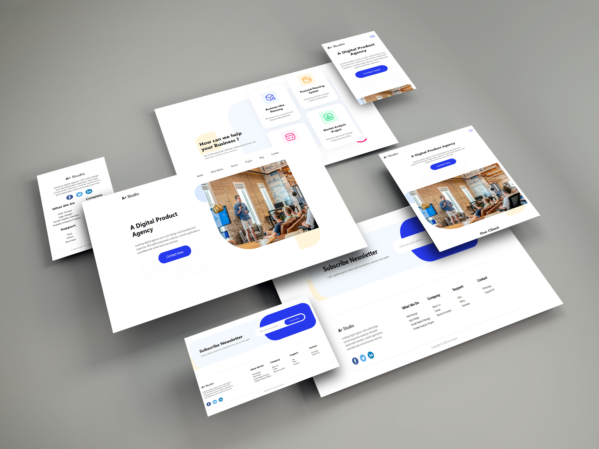

## Creative sample of the website portfolio presentation
___
### This is template of the portfolio presentation website.
The main feature of the project is a creative beautiful scrolling animation (Wow.js/Animate.css is used).

✔️ **Fully responsive web design**

✔️ **Cross-browser compatibility**

✔️ **Valid, semantic HTML5 markup structure**

✔️ **Verified by the W3C validator**

✔️ **Styled by Tailwind+SCSS**

✔️ **Basic SEO optimization included correct meta tags**

✔️ **Optimized by Google PageSpeed Insights requirements (see attached screens above)**
  - optimized web fonts
  - optimized images with webp support
  - minified styles using cssnano
  - optimized JS using Webpack

✔️ **Clear, readable, maintainable and editable code**
___
✅ HTML5

✅ CSS(Tailwind\SCSS)+Animate.css 

✅ JS+Wow.js

✅ Gulp+Webpack
___

